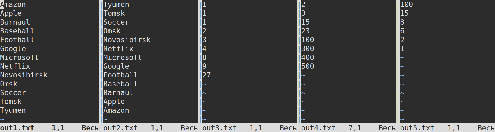

# Решённое задание отборочного этапа ШИФТ компании ЦФТ (Java, 2023 г.)

## Особенности реализации

Программа сортирует содержимое нескольких файлов, отбрасывая только те строки, которые бы сделали вывод программы в файл неотсортированным.
Также пропускаются некорректные данные, например, не число, когда указан параметр `-i`.

Все входные файлы, которые не открываются, пропускаются (печатается предупреждение).

При запуске с неправильными, недостающими или лишними параметрами программа печатает небольшую справку о том, как правильно запускать программу.
Это типичное поведение инструментов командной строки в Unix-подобных системах.

Программа в режиме чисел поддерживает неограниченно большие числа (но неотрицательные).

В проекте есть тесты и базовая документация.

## Информация о сборке

- Версия Java: 17
- Система сборки: Maven 3.6.3
- Используются библиотеки Lombok 1.18.28, Apache Common Lang 3.13.0, Junit 5.10.0, Mockito 5.4.0 (указаны в `pom.xml`).
- Зависимости в формате Maven:

```xml
<dependency>
    <groupId>org.junit.jupiter</groupId>
    <artifactId>junit-jupiter-api</artifactId>
    <version>5.10.0</version>
    <scope>test</scope>
</dependency>
<dependency>
    <groupId>org.junit.jupiter</groupId>
    <artifactId>junit-jupiter-engine</artifactId>
    <version>5.10.0</version>
    <scope>test</scope>
</dependency>
<dependency>
    <groupId>org.mockito</groupId>
    <artifactId>mockito-core</artifactId>
    <version>5.4.0</version>
    <scope>test</scope>
</dependency>
<dependency>
    <groupId>org.mockito</groupId>
    <artifactId>mockito-junit-jupiter</artifactId>
    <version>5.4.0</version>
    <scope>test</scope>
</dependency>
<dependency>
    <groupId>org.projectlombok</groupId>
    <artifactId>lombok</artifactId>
    <version>1.18.28</version>
    <scope>provided</scope>
</dependency>
<dependency>
    <groupId>org.apache.commons</groupId>
    <artifactId>commons-lang3</artifactId>
    <version>3.13.0</version>
</dependency>
```


## Инструкция по запуску

Запустите следующие команды в консоли:

Unix:
```
mvn clean package
java -jar target/testTaskCFT-1.0.jar -a -s output/out1.txt input/str_asc_1.txt  input/str_asc_2.txt  input/str_asc_3.txt
java -jar target/testTaskCFT-1.0.jar -d -s output/out2.txt input/str_desc_1.txt input/str_desc_2.txt input/str_desc_3.txt
java -jar target/testTaskCFT-1.0.jar -a -i output/out3.txt input/num_asc_1.txt  input/num_asc_2.txt  input/num_asc_3.txt
java -jar target/testTaskCFT-1.0.jar -a -i output/out4.txt input/num_rand_1.txt input/num_rand_2.txt input/num_rand_3.txt
java -jar target/testTaskCFT-1.0.jar -d -i output/out5.txt input/num_rand_1.txt input/num_rand_2.txt input/num_rand_3.txt
```

Windows:
```
mvn clean package
java -jar target\testTaskCFT-1.0.jar -a -s output\out1.txt input\str_asc_1.txt  input\str_asc_2.txt  input\str_asc_3.txt
java -jar target\testTaskCFT-1.0.jar -d -s output\out2.txt input\str_desc_1.txt input\str_desc_2.txt input\str_desc_3.txt
java -jar target\testTaskCFT-1.0.jar -a -i output\out3.txt input\num_asc_1.txt  input\num_asc_2.txt  input\num_asc_3.txt
java -jar target\testTaskCFT-1.0.jar -a -i output\out4.txt input\num_rand_1.txt input\num_rand_2.txt input\num_rand_3.txt
java -jar target\testTaskCFT-1.0.jar -d -i output\out5.txt input\num_rand_1.txt input\num_rand_2.txt input\num_rand_3.txt
```

Открыв файлы out1.txt, out2.txt, ..., out5.txt в папке `output`, можно убедиться, что данные в них отсортированы корректно.


